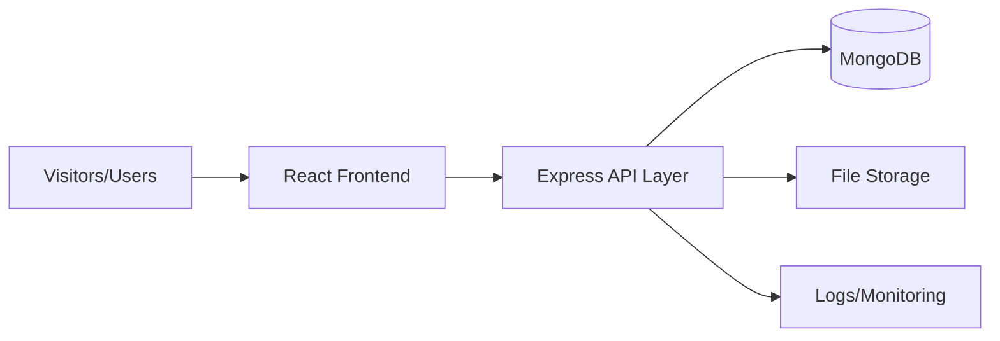
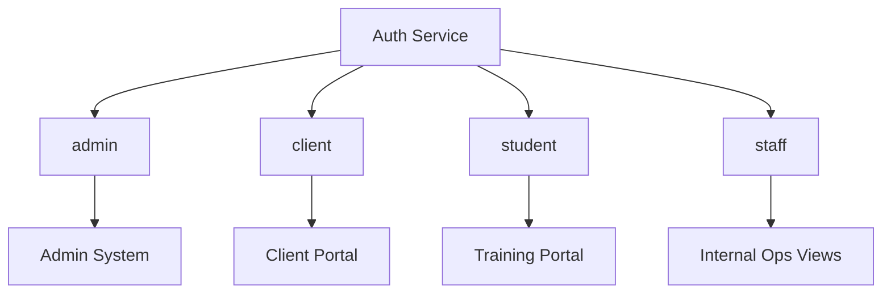
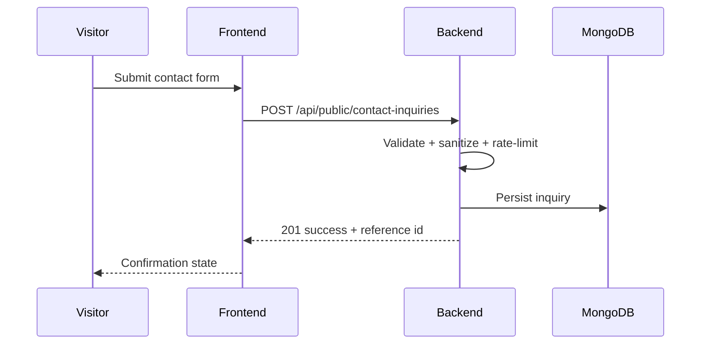

# Aerogarage Website Master Workflow

## 1) Objective
Build a production-grade aviation platform with:
- Public Website (brand + lead generation)
- Client Portal (airline/airport operations users)
- Training Portal (students and exam pipeline)
- Admin System (internal operations and content control)

## 2) Product Streams
- Stream A: Public Brand and Conversion
- Stream B: Portal Authentication and RBAC
- Stream C: Operations Modules (client/training/admin)
- Stream D: Security, QA, and Performance
- Stream E: Deployment and Monitoring

## 3) Phase Plan

### Phase P1: Discovery and Governance
- Confirm ICP: airline procurement, airport ops, training candidates.
- Freeze primary CTA: `Request Corporate Proposal`.
- Freeze secondary CTA: `Explore Service Portfolio`.
- Approve copy tone: institutional, safety-first, audit-ready.
- Output: signed requirements checklist.

### Phase P2: Design System Foundation
- Lock design tokens (colors, spacing, radius, elevation, typography scale).
- Finalize component primitives (Button, Card, Input, Table, Modal, Tabs, Alert).
- Define motion rules with reduced-motion fallback.
- Output: reusable UI kit and token file ownership.

### Phase P3: Public UX Architecture
- IA for Home, About, Services, Training, Careers, Contact.
- Section-level wireframe map and CTA path.
- Trust architecture: proof stats, partner strip, compliance blocks.
- Output: approved UX map and copy placeholders.

### Phase P4: Public Page Production Build
- Home showpiece (hero, proof row, service preview, CTA band).
- About credibility sections (timeline, pillars, partnerships, governance).
- Services hub + detail templates.
- Training and Careers narrative pages.
- Contact page with conversion-focused form UX.
- Output: complete production-ready public website.

### Phase P5: Backend Public APIs
- `POST /api/public/contact-inquiries`
- `POST /api/public/careers-applications`
- `GET /api/public/content/services`
- `GET /api/public/content/training`
- Add validation, standard response envelope, and logging.
- Output: frontend integrated with live APIs.

### Phase P6: Auth + RBAC
- Register/Login/Refresh/Logout.
- Roles: `admin`, `client`, `student`, `staff`.
- Backend guards + frontend route guards.
- Token expiry handling and forced re-login UX.
- Output: secure access boundaries.

### Phase P7: Client Portal
- Dashboard summary + service request create/track.
- Documents/reports view and download workflow.
- Profile/settings and audit history.
- Output: operational client self-service portal.

### Phase P8: Training Portal
- Student dashboard, module progress, exam schedule/results.
- Resource center and download controls.
- Output: training lifecycle portal.

### Phase P9: Admin System
- User and role management.
- Service request operations.
- Training management.
- Public content management.
- Output: centralized internal operations console.

### Phase P10: Security, QA, and Release
- Security headers, CORS policy, rate limits, input sanitization.
- Smoke tests, RBAC tests, error-path tests.
- Lighthouse, accessibility, responsive sweep.
- CI/CD and rollback runbook.
- Output: production release candidate.

## 4) UX Workflow (Execution Loop)
1. Section goal definition
2. Wireframe
3. High-fidelity visual
4. Frontend build
5. Content integration
6. QA and accessibility check
7. Performance optimization
8. Stakeholder signoff

## 5) Security Checklist

### Backend
- Enforce env validation on boot (`PORT`, `MONGO_URI`, auth secrets).
- Apply `helmet`-grade security headers (or equivalent middleware already implemented).
- Strict CORS allowlist by environment.
- Rate limiting on auth/public forms.
- Input schema validation on every write endpoint.
- Centralized error handler without stack leaks in production.
- JWT with expiry + refresh token rotation.
- Password hashing with strong cost factor.
- Audit logs for admin actions.

### Frontend
- Store tokens securely (prefer HttpOnly cookie strategy in future hardening).
- Guard protected routes by role.
- Sanitize rich text/content before render.
- Graceful error boundaries and API failure states.
- Reduced motion and keyboard accessibility.

### Infrastructure
- HTTPS only in production.
- Secrets in environment manager, not in repo.
- DB backups and restore drill.
- Monitoring and alert thresholds (error rate, 5xx spikes, auth failures).

## 6) Diagram Set

### A) High-Level Architecture

### B) Role and Access Model

### C) Lead Capture Flow

## 7) Media and Partner Governance
- Current implementation includes RJAA as featured training partner with logo slot.
- Replace placeholder file with official approved logo:
  - Path: `aerogarage/public/images/partners/rjaa-logo.svg`
- Add legal check: logo usage permission and brand guideline compliance before production publish.

## 8) Acceptance Criteria for Professional Readiness
- All pages responsive on desktop/tablet/mobile.
- Lighthouse target: Performance >= 90, Accessibility >= 95, Best Practices >= 95, SEO >= 95.
- RBAC verified for all protected routes.
- No critical OWASP issues in baseline scan.
- Error tracking and log visibility live before release.
